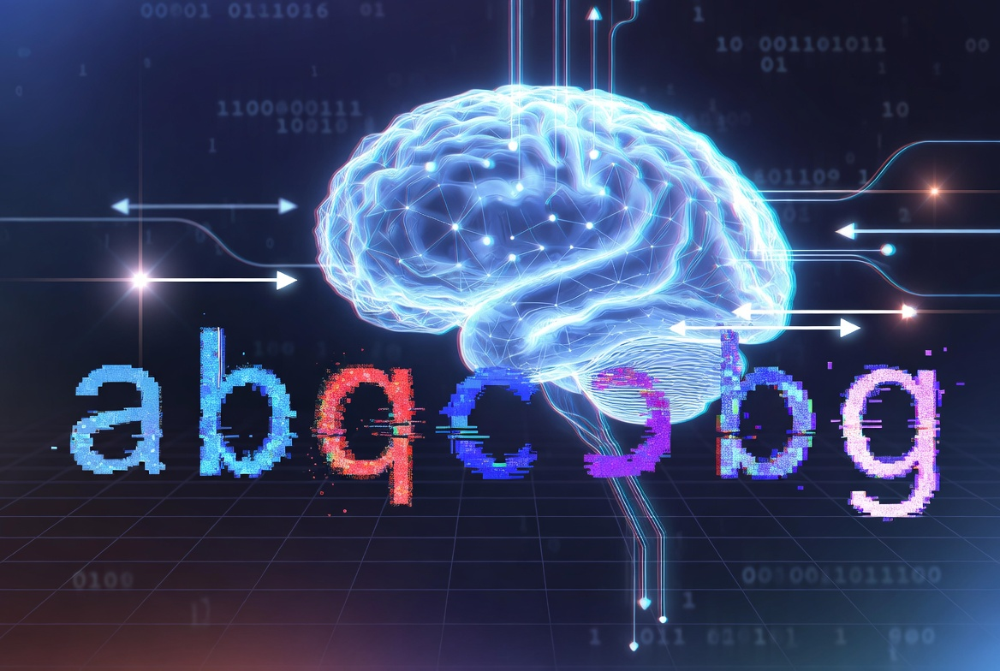

# <center> **PROJECT: English Letters CAPTCHA Recognition**

Convolutional Neural Network for recognizing distorted and noisy images of English alphabet letters (A–Z).

---

<div align="center">
  
</div>

---

### **Project Goal**

Develop a robust image classification model capable of high-accuracy recognition of English letters under significant noise, distortion, and blur — a task relevant to CAPTCHA systems and document processing.

---

### **Dataset**

- 20,000 training images (48×48, RGB)
- 26 classes (letters A to Z)
- Heavily distorted and noisy images
- Test set: 50,000 unlabeled images

---

### **Model Architecture**

**Total parameters:** 988,122 (3.77 MB)

**Key Layers:**
- Multiple `Conv2D` + `BatchNormalization` + `MaxPooling2D` blocks
- `Flatten` + `Dense(256)` with `Dropout`
- Output layer with 26 classes (`softmax`)

---

### **Technologies Used**

- `TensorFlow` / `Keras`
- `pandas`, `numpy`
- Data Augmentation (`ImageDataGenerator`)
- `BatchNormalization` and `Dropout` for regularization
- Visualization: `matplotlib`, `seaborn`, `plotly`

---

### **Results**

- **Validation Accuracy**: **0.9003** (90.03%)
- Successfully handled heavy noise and distortions
- Strong generalization thanks to data augmentation and regularization

---

### **Project Stages**

1. Basic data analysis and exploration
2. Data preparation and augmentation
3. Model development (CNN architecture)
4. Training with regularization techniques
5. Evaluation and conclusions

---

### **Key Achievements**

- Built a deep CNN capable of recognizing letters under heavy noise
- Applied effective data augmentation strategies
- Achieved **90.03%** accuracy on validation set

---

### **Project Structure**

- `notebooks/` — main training notebook
- `src/` — model utilities
- `data/` — `.npy` files
- `figures/` — training plots and predictions
- `requirements.txt`

---

### **Conclusion**

This project demonstrates the ability to build a resilient Convolutional Neural Network for image classification under challenging noisy conditions. Achieving over 90% accuracy on distorted letter images highlights strong skills in computer vision and deep learning model optimization.

---

### **How to run**

```bash
cd Computer-Vision.English-Letters-CAPTCHA-Recognition

pip install -r requirements.txt

jupyter notebook "PROJECT - Computer Vision. English Letters Recognition on Noisy Images.ipynb"