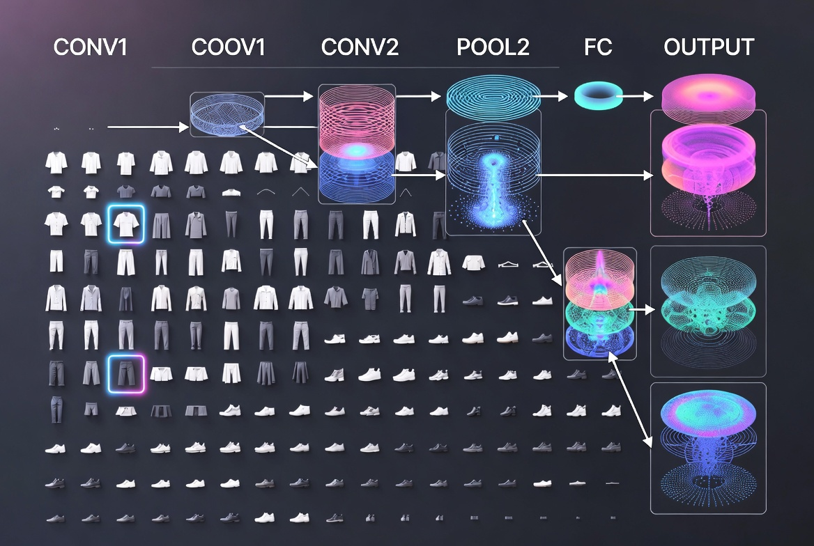

<div align="center">
  
</div>

# <center> **PROJECT: Fashion-MNIST Classification**

Image classification model for recognizing 10 categories of clothing items using Convolutional Neural Network.

---

### **Project Goal**

Build a robust CNN model to classify images from the Fashion-MNIST dataset — a more challenging drop-in replacement for the original MNIST dataset, closer to real-world retail scenarios.

---

### **Dataset**

- **Fashion-MNIST**
- 60,000 training images + 10,000 test images
- 28×28 grayscale images
- 10 classes: T-shirt/top, Trouser, Pullover, Dress, Coat, Sandal, Shirt, Sneaker, Bag, Ankle boot

---

### **Model Architecture**

```python
Model: "sequential"
_________________________________________________________________
 Layer (type)                Output Shape              Param #   
=================================================================
 reshape (Reshape)           (None, 28, 28, 1)         0         
 conv2d (Conv2D)             (None, 26, 26, 32)        320       
 max_pooling2d (MaxPooling2D) (None, 13, 13, 32)       0         
 conv2d_1 (Conv2D)           (None, 11, 11, 64)        18496     
 max_pooling2d_1 (MaxPooling2D) (None, 5, 5, 64)       0         
 flatten (Flatten)           (None, 1600)              0         
 dense (Dense)               (None, 128)               204928    
 dropout (Dropout)           (None, 128)               0         
 dense_1 (Dense)             (None, 10)                1290      
=================================================================
Total params: 225,034 (879.04 KB)