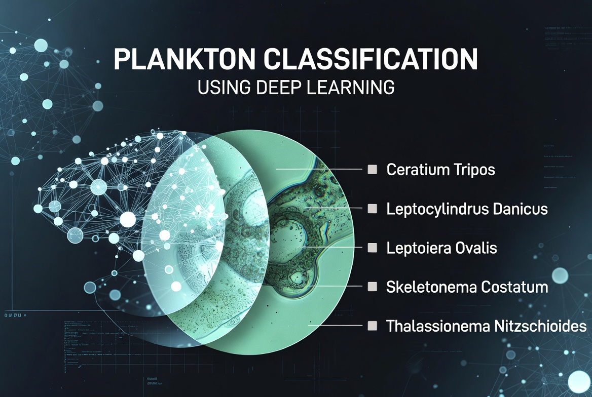

<div align="center">
  
</div>

# <center> **PROJECT: Plankton Classification**  
ResNet18 Transfer Learning on Small Imbalanced Dataset

Image classification of plankton species using transfer learning on a highly imbalanced and limited dataset.

---

### **Project Goal**

Develop a robust classification model for three plankton species (`amoeba`, `Leegaardiella_ovalis`, `Mesodinium_sp`) under challenging conditions: small dataset size and severe class imbalance.

---

### **Dataset**

- **Classes**: 3 plankton species
- **Source**: WHOI-Plankton dataset
- **Key Challenges**: Very limited samples, strong class imbalance
- **Task**: Multiclass classification

---

### **Strategies Compared**

| Strategy                        | Architecture              | Augmentation          | Batch Size | Best Val F1-macro | Peak Epoch | Overfitting |
|---------------------------------|---------------------------|-----------------------|------------|-------------------|------------|-------------|
| Custom CNN from scratch         | Custom ResNet-like        | Differentiated        | 16         | 0.7654            | 21         | Strong      |
| ResNet18 — Head only            | Pretrained ResNet18       | Differentiated        | 16         | **0.8667**        | 31         | Moderate    |
| ResNet18 — Partial fine-tuning  | Pretrained ResNet18       | Differentiated        | 16         | 1.0000            | 50         | Very Strong |
| ResNet18 — Full fine-tuning     | Pretrained ResNet18       | Differentiated        | 16         | 1.0000            | 12         | Very Strong |

**Best Strategy**: `ResNet18` with **head-only** training (only the classifier layer is trained, backbone frozen).

---

### **Technologies Used**

- **Deep Learning**: `PyTorch`, `torchvision`
- **Data Processing**: `pandas`, `numpy`, `PIL`, `cv2`
- **Augmentations**: `albumentations`
- **Training**: `GradScaler`, `ReduceLROnPlateau`, `CosineAnnealingLR`
- **Visualization**: `matplotlib`, `seaborn`

---

### **Key Achievements**

- Successfully applied **Transfer Learning** on a very small and imbalanced biological dataset
- Achieved **0.8667 F1-macro** using `ResNet18` with head-only fine-tuning
- Conducted comprehensive comparison of different fine-tuning strategies
- Developed effective differential augmentation strategy for imbalanced classes

---

### **Project Stages**

1. Data loading and exploration
2. Image preprocessing and filtering
3. Advanced data augmentation
4. Model development and experiments (from scratch vs transfer learning)
5. Hyperparameter tuning and training strategies
6. Comparative analysis and conclusions

---

### **Project Structure**

- `notebooks/` — main Jupyter notebook
- `src/` — custom dataset, models, training utils
- `data/` — raw images
- `figures/` — EDA plots, training curves, confusion matrices
- `requirements.txt`

---

### **Conclusion**

This project demonstrates strong skills in handling real-world challenges of computer vision: small data volume and class imbalance. The best result was achieved using ResNet18 with head-only fine-tuning, proving the effectiveness of transfer learning for biological image classification tasks with limited data.

---

### **How to run**

```bash
cd Computer-Vision.Plankton-Classification

pip install -r requirements.txt

jupyter notebook "PROJECT - Computer Vision. Plankton Classification with ResNet18.ipynb"